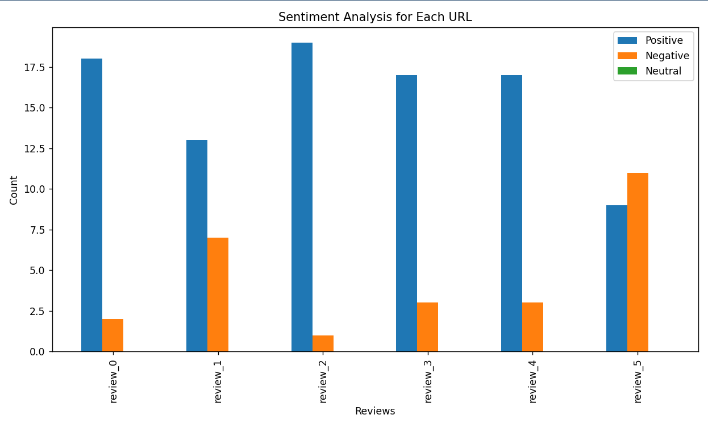

# Sentiment Analysis Project

## Overview
This project is a sentiment analysis tool that fetches product reviews from a website, analyzes their sentiment using a pre-trained model, and visualizes the results. The project is modular and includes fetching reviews, sentiment analysis, and plotting functionality.

---

## Features
- Fetch reviews from a given URL.
- Analyze the sentiment of each review (positive, negative, or neutral).
- Save reviews with sentiment annotations to a file.
- Visualize the sentiment distribution using bar charts.

---

## Prerequisites

-   Python (version 3.10.13)
Required libraries:

  - matplotlib
  - requests
  - beautifulsoup4
  - torch
  - transformers
  - pytest
  - setuptools
  - wheel
  - tqdm 
  - numpy
  
## Project Structure

```bash
CS325
│
├── main.py
├── get_review.py
├── response_generator.py
├── plot_sentiment.py
├── input.txt
└── requirement.yaml
```
## Installation

Install my-project with conda:
1.  First, create a new conda environment using the provided requirement.yaml file:

```bash
   conda env create -f requirement.yaml
```

2.  Activate the environment:
```bash
   conda activate sentiment-analysis
```
    
## Usage
1.  Add review URLs to input.txt
2.  Run main script:

```bash
    python main.py
```
3.  Sentiment analysis results will be saved in the output/ directory, and a sentiment distribution chart will be displayed.
## Running Tests

To run tests, run the following command:

```bash
  pytest test_case.py
```

## Image Of The Matplotlib


## License

[MIT](https://choosealicense.com/licenses/mit/)

This project is licensed under the MIT License. You are free to use, modify, and distribute this project as long as proper attribution is provided.


